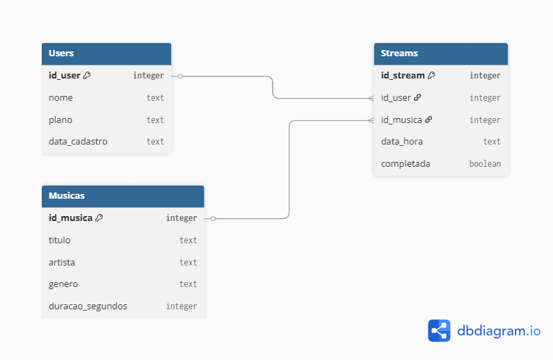
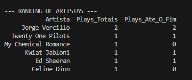

# Pipeline de Streaming Musical

Este projeto simula a infraestrutura de dados de uma plataforma de streaming musical. Através da construção de um pipeline ETL, o sistema gerencia informações de usuários, um catálogo de músicas e o histórico de reproduções (streams), permitindo a extração de métricas de consumo.


## Status do Projeto
- [x] **Fase 1: Modelagem e Criação do Banco de Dados** - Concluído.
- [x] **Fase 2: Injeção de Dados (ETL)** - Concluído.
- [x] **Fase 3: Consultas e Geração de Relatórios** - Concluído.


## O que foi desenvolvido (Fase 1: Modelagem)
Nesta etapa, o banco de dados `streaming_music.db` foi estruturado e as tabelas foram criadas, divididas em três centrais:



- **Tabela `Users`:** Consta os usuários da plataforma com seus respectivos dados cadastrais.
- **Tabela `Musicas`:** Catálogo de músicas com título, artista, gênero e duração em segundos.
- **Tabela `Streams`:** Tabela principal do modelo que registra cada play dado na plataforma, conectando o usuário à música e indicando o horário, além de uma coluna booleana `completada` para sinalizar se a música foi ouvida até o final ou pulada.


## O que foi desenvolvido (Fase 2: Injeção de Dados)
Nesta etapa, populei o banco com dados simulados, representando um cenário real de streaming:
- **Usuários** com planos distintos (`Free` e `Premium`).
- **Músicas** de gêneros variados (`Rock`, `Pop` e `MPB`).
- **Históricos de stream**, com diferentes combinações de usuário, música e horário de reprodução.
- Utilizei `executemany()` com placeholders `?` para inserção segura dos dados.


## O que foi desenvolvido (Fase 3: Consultas e Relatórios)
Nesta etapa, transformei os dados brutos em informação através de consultas SQL:
- **JOIN** Cruzei as três tabelas (`Streams`, `Users` e `Musicas`) para gerar um relatório completo de reproduções.
- **CASE WHEN:** Adicionei rótulos legíveis (`Sim` / `Não (Pulou)`) na coluna booleana `completada`, facilitando a análise de engajamento.
- **Relatório de Streaming:** Um relatório gerado com `pandas.read_sql_query()`, exibindo usuário, música, artista, horário e se a música foi ouvida até o fim.
- **Ranking de Artistas:** Usei funções de agregação (`GROUP BY`, `COUNT` e `SUM`) para consolidar a quantidade de reproduções, criando um ranking decrescente de popularidade dos artistas mais tocados na plataforma. 


## Resultado Final
Abaixo, um exemplo do ranking de popularidade gerado pelo pipeline, consolidando os dados de streams por artista:




## Tecnologias e Bibliotecas
- **Banco de Dados:** SQLite.
- **Manipulação:** Pandas.
- **Linguagem:** Python.
- **Conceitos aplicados:** Modelagem relacional, Foreign Keys, ETL, JOIN, CASE WHEN.


## Estrutura de Pastas
```
├── data/
│   └── streaming_music.db   # Banco de dados (ignorado no Git)
├── .gitignore
├── img/                     # Imagens do README
├── 01_create_db.py          # Criação das tabelas
├── 02_data_injection.py     # Injeção dos dados
├── 03_queries.py            # Consultas e relatórios
└── README.md
```
